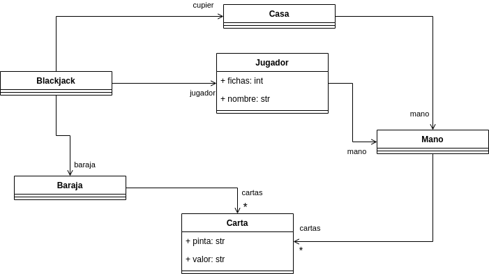
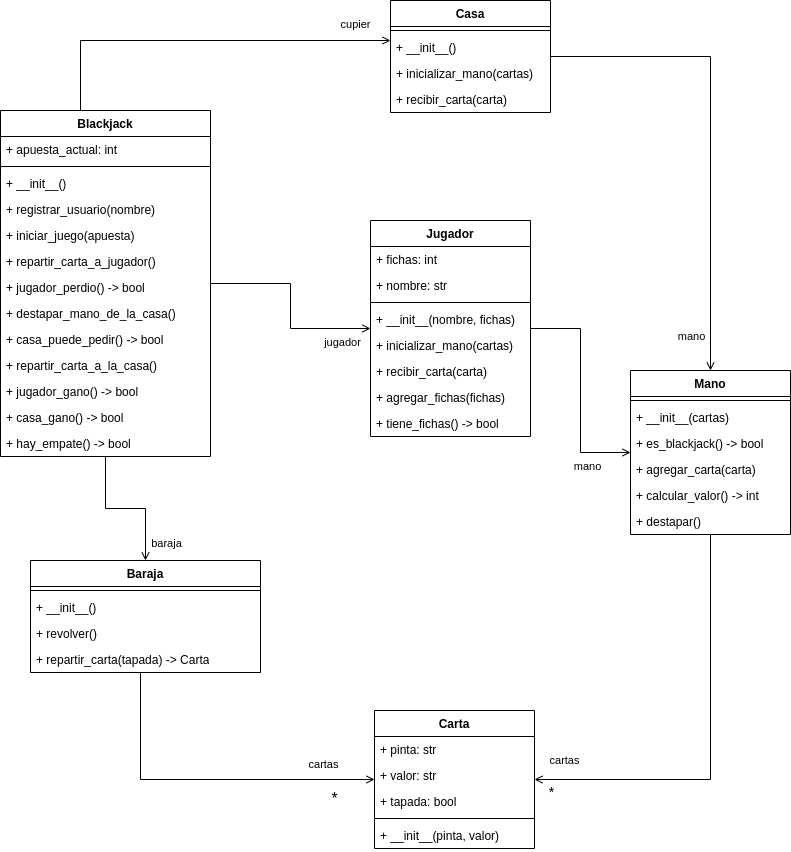
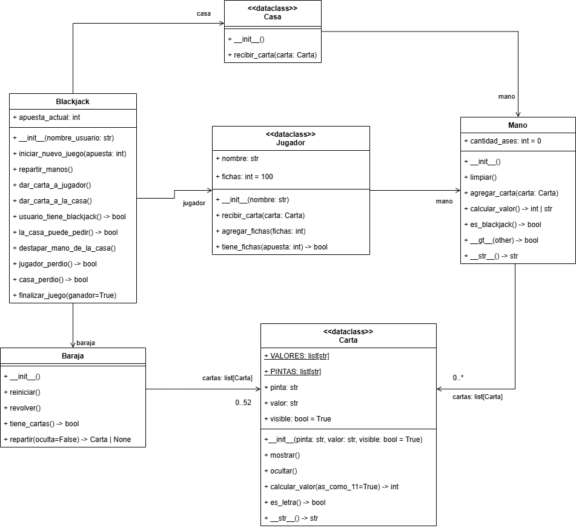

# Desarrollo de un juego de blackjack

## Descripción del juego
Este ejercicio consiste en desarrollar una aplicación para simular un juego de blackjack o 21 entre
un jugador y la casa (en este caso la casa está representada por el sistema). El objetivo del juego es
que la mano del jugador llegue lo más cerca posible a 21 sin pasarse. Si la mano del jugador se pasa
de 21, pierde el juego. Si no se pasa de 21, entonces se compara con la mano de la casa para ver
quien estuvo más cerca. Si la mano de la casa se pasa de 21, el jugador gana.

En el juego de blackjack hay una baraja que contiene 52 cartas. Cada carta tiene una pinta y un valor.
Las pintas pueden ser CORAZÓN, TRÉBOL, DIAMANTE y ESPADA; los valores pueden ser A, 2, 3, 4, 5,
6, 7, 8, 9, 10, J, Q, K.

Cada carta vale lo mismo que el número que representa, excepto las cartas cuyo valor es una letra.
Para estas cartas, el valor se determina así:

- Si la carta es J, Q o K, el valor es 10
- Si la carta es A, el valor puede ser 11 o 1 

Cuando arranca la aplicación, el sistema le pregunta el nombre al jugador para registrarlo y este
inicia el juego con 100 fichas.

Al iniciar el juego, el jugador decide cuantas fichas apostar y, luego de la apuesta, tanto el jugador
como la casa reciben una mano. La mano inicialmente contiene 2 cartas. Para el jugador ambas cartas
de la mano inicial están destapadas. Para la casa, una carta está destapada, la otra está oculta (boca
abajo).

Una vez se reparten las manos, inicia el turno del jugador. Si el valor de las cartas iniciales de la
mano del jugador suma 21, automáticamente gana el juego, ya que logró hacer blackjack. Si no es
así, entonces, el jugador puede pedir una nueva carta para su mano o detenerse. Si pide una nueva
carta, esta se suma al valor de su mano. Si el valor es mayor de 21, pierde inmediatamente el juego,
si no lo es puede seguir pidiendo cartas hasta que decida detenerse.

Cuando el jugador se detiene comienza el turno de la casa. En dicho turno, se destapa la carta oculta
de la mano de la casa y esta puede empezar a pedir cartas. La lógica de la casa para pedir cartas es
la siguiente:

- Si el valor de la mano de la casa es menor o igual al valor de la mano del jugador y el valor de la
mano de la casa no es mayor que 16, entonces pide una carta.
- Si con la nueva carta, el valor de la mano de la casa sobrepasa 21, la casa pierde el juego.

En caso de empate entre la casa y el jugador, el jugador recibe lo que apostó en la mano. Si el jugador
gana, la casa le dobla lo apostado. Y si el jugador pierda, se le resta lo apostado de sus fichas.

La idea es que la aplicación durante un juego vaya mostrando las manos tanto del jugador como de
la casa y le dé la opción al jugador de pedir una nueva carta o parar.

El jugador solo podrá jugar mientras tenga fichas disponibles para apostar.

## Modelo del mundo del problema

 

## Requisitos funcionales

### R1 - Registrar jugador

| <!-- --> 	      | <!-- --> 	                                                                                                                                                                                         |
|:----------------|:---------------------------------------------------------------------------------------------------------------------------------------------------------------------------------------------------|
| **Resumen** 	   | El sistema debe permitir registrar un jugador para poder iniciar un juego 	                                                                                                                        |
| **Entrada** 	   | - Nombre del jugador 	                                                                                                                                                                             |
| **Resultado** 	 | 1. El sistema muestra un mensaje dando la bienvenida al jugador<br>2. El sistema carga 100 fichas al jugador<br>3. El sistema muestra un menú con las opciones de iniciar un nuevo juego o salir 	 |


#### Descomposición del requisito

| Paso              | Método                       | Responsable |
|-------------------|------------------------------|-------------|
| Registrar jugador | registrar_jugador(nombre)    | Blackjack   |
| Crear jugador     | \_\_init\_\_(nombre, fichas) | Jugador     |


### R2 - Iniciar juego

|               	|                                                                                                                                                                                                                                                                                                                                                                                                                                 	|
|---------------	|---------------------------------------------------------------------------------------------------------------------------------------------------------------------------------------------------------------------------------------------------------------------------------------------------------------------------------------------------------------------------------------------------------------------------------	|
| **Resumen**   	| El sistema permite iniciar un juego, repartiendo las cartas al jugador y la casa                                                                                                                                                                                                                                                                                                                                                	|
| **Entradas**  	| - Apuesta del jugador                                                                                                                                                                                                                                                                                                                                                                                                           	|
| **Resultado** 	| 1. El sistema recibe la apuesta del jugador<br>2. Revolver las cartas<br>3. El sistema reparte dos cartas destapadas al jugador<br>4. El sistema reparte dos cartas a la casa, una destapada y la otra tapada<br>5. El sistema verifica si la mano del jugador es blackjack<br>5.1 Si tiene blackjack, se ejecuta el requisito R5 Finalizar juego<br>5.2 Si no tiene blackjack, se ejecuta el requisito R3 Hacer jugada jugador 	|

#### Descomposición del requisito

| Paso                              | Método                                | Responsable   |
|-----------------------------------|---------------------------------------|---------------|
| Iniciar juego                     | iniciar_juego(apuesta)                | Blackjack     |
| Revolver cartas                   | revolver()                            | Baraja        |
| Repartir carta                    | repartir_carta(tapada: bool) -> Carta | Baraja        |
| Inicializar la mano               | inicializar_mano(cartas)              | Casa, Jugador |
| Crear mano                        | \_\_init\_\_(cartas)                  | Mano          |
| Verificar si la mano es blackjack | es_blackjack() -> bool                | Mano          |

### R3 - Hacer jugador del jugador

|               	|                                                                                                                                                                                                                                                                                                                                                                                                                                                                                                                          	|
|---------------	|--------------------------------------------------------------------------------------------------------------------------------------------------------------------------------------------------------------------------------------------------------------------------------------------------------------------------------------------------------------------------------------------------------------------------------------------------------------------------------------------------------------------------	|
| **Resumen**   	| El sistema debe permitir que el jugador realice una jugada durante su turno                                                                                                                                                                                                                                                                                                                                                                                                                                              	|
| **Entradas**  	| - decisión (pedir carta o plantarse)                                                                                                                                                                                                                                                                                                                                                                                                                                                                                     	|
| **Resultado** 	| 1. El sistema solicita al jugador que seleccione una jugada<br>2. Si el jugador pide una carta<br>2.1 El sistema le reparte una carta a la mano del jugador<br>2.2 Si el valor de la mano del jugador es mayor a 21<br>2.2.1 Se ejecuta el requisito R5 finalizar juego<br>2.3 Si el valor de la mano no supera 21<br>2.3.1 Se vuelve a ejecutar el requisito R3<br>3. Si el jugador se planta <br>3.1 Se calcular el valor de la mano, se muestra y se guarda<br>3.2 Se ejecuta el requisito R4 hacer jugada de la casa 	|

#### Descomposición del requisito

| Paso                                  | Método                                | Responsable |
|---------------------------------------|---------------------------------------|-------------|
| Repartir carta a jugador              | repartir_carta_a_jugador()            | Blackjack   |
| Repartir carta                        | repartir_carta(tapada: bool) -> Carta | Baraja      |
| Recibir carta                         | recibir_carta(carta)                  | Jugador     |
| Agregar carta a mano                  | agregar_carta(carta)                  | Mano        |
| Calcular el valor de la mano          | calcular_valor() -> int               | Mano        |
| Verificar si el jugador se pasó de 21 | jugador_perdio() -> bool              | Blackjack   |

### R4 - Hacer jugada de la casa

|               	|                                                                                                                                                                                                                                                                                                                                                                                                                                                                                                                                                                                                                                 	|
|---------------	|---------------------------------------------------------------------------------------------------------------------------------------------------------------------------------------------------------------------------------------------------------------------------------------------------------------------------------------------------------------------------------------------------------------------------------------------------------------------------------------------------------------------------------------------------------------------------------------------------------------------------------	|
| **Resumen**   	| El sistema debe permitir que la casa realice una jugada durante su turno                                                                                                                                                                                                                                                                                                                                                                                                                                                                                                                                                        	|
| **Entradas**  	| Ninguna                                                                                                                                                                                                                                                                                                                                                                                                                                                                                                                                                                                                                         	|
| **Resultado** 	| 1. Destapar la carta oculta de la casa<br>2. Si la mano de la casa es blackjack<br>2.1 Se ejecuta el requisito R5 finalizar juego (la casa gana)<br>3. Si la mano de la casa no es blackjack<br>3.1 Si la mano de la casa es menor o igual que 16 y menor que la mano del jugador<br>3.1.1 Se reparte una carta a la mano de la casa<br>3.1.2 Se calcula el valor de la mano se vuelve a evaluar (punto 3.1)<br>3.2 Si la mano de la casa es mayor a 16 y menor o igual a 21<br>3.2.1 Se ejecuta el requisito R5 Finalizar juego<br>3.3 Si la mano de la casa se pasó de 21<br>3.3.1 Se ejecuta el requisito R5 Finalizar juego 	|

#### Descomposición del requisito

| Paso                                         | Método                               | Responsable |
|----------------------------------------------|--------------------------------------|-------------|
| Destapar la mano de la casa                  | destapar_mano_de_la_casa()           | Blackjack   |
| Destapar mano                                | destapar()                           | Mano        |
| Verificar si la mano de la casa es blackjack | es_blackjack() -> bool               | Mano        |
| Verificar si la casa puede pedir             | casa_puede_pedir() -> bool           | Blackjack   |
| Repartir carta a la casa                     | repartir_carta_a_la_casa()           | Blackjack   |
| Repartir carta                               | repartir_carta(tapada:bool) -> Carta | Baraja      |
| Agregar carta a la mano                      | recibir_carta(carta)                 | Casa        |
| Calcular valor de la mano                    | calcular_valor() -> int              | Mano        |

### R5 - Finalizar juego

|               	|                                                                                                                                                                                                                                                                                                                                                                                                                                                                                                                                                                                                                                                                                                                                                                                                                                                                                                           	|
|---------------	|-----------------------------------------------------------------------------------------------------------------------------------------------------------------------------------------------------------------------------------------------------------------------------------------------------------------------------------------------------------------------------------------------------------------------------------------------------------------------------------------------------------------------------------------------------------------------------------------------------------------------------------------------------------------------------------------------------------------------------------------------------------------------------------------------------------------------------------------------------------------------------------------------------------	|
| **Resumen**   	| El sistema debe permitir que se finalice la partida y se determine el ganador                                                                                                                                                                                                                                                                                                                                                                                                                                                                                                                                                                                                                                                                                                                                                                                                                             	|
| **Entradas**  	| Ninguna                                                                                                                                                                                                                                                                                                                                                                                                                                                                                                                                                                                                                                                                                                                                                                                                                                                                                                   	|
| **Resultado** 	| 1. El sistema compara las manos del jugador y de la casa <br>2. Si el jugador tiene blackjack, su mano es mayor que la mano de la casa o la mano de la casa superó 21 <br>2.1 El sistema anuncia el jugador como ganador <br>2.2 Se doblan las fichas de la apuesta realizada <br>3. Si la casa tiene blackjack, su mano es mayor que la mano del jugador o la mano del jugador superó 21 <br>3.1 El sistema anuncia que el jugador perdió <br>3.3 Se restan las fichas de la apuesta de las fichas del jugador <br>4. Si la mano del jugador y la mano de la casa tienen el mismo valor <br>4.1 El sistema anuncia empate <br>4.2 se devuelven las fichas apostadas al jugador<br>5. Si el usuario tiene fichas disponibles<br>5.1 Se presenta un menú con las opciones para iniciar un nuevo (R2) o salir de la aplicación<br>6. Si usuario no tiene fichas disponibles<br>6.1 Se termina la aplicación 	|

#### Descomposición del requisito

| Paso                              | Método                  | Responsable |
|-----------------------------------|-------------------------|-------------|
| Verificar si jugador ganó         | jugador_gano() -> bool  | Blackjack   |
| Agregar fichas al jugador         | agregar_fichas(fichas)  | Jugador     |
| Verificar si la casa ganó         | casa_gano() -> bool     | Blackjack   |
| Verificar si hay empate           | hay_empate() -> bool    | Blackjack   |
| Devolver fichas al jugador        | agregar_fichas(fichas)  | Jugador     |
| Verificar si jugador tiene fichas | tiene_fichas() -> bool  | Jugador     |

### Versión 1 del modelo del diseño de la solución



Luego de iterar sobre el modelo del diseño de la solución, se llegó a la siguiente versión:

### Versión 2 del modelo del diseño de la solución



Tu tarea es implementar el modelo del diseño de la solución en Python. Para ello, debes tener en cuenta lo siguiente:

1. **Clase** `Carta`
   - La clase se debe implementar como una `dataclass`
   - Las constantes `VALORES` y `PINTAS` deben ser implementadas como atributos de clase. La constante VALORES debe
   tener como valor por defecto una lista de `str` con los posibles valores de las cartas, iniciando en 'A' y terminando
   en 'K'. La constante PINTAS debe tener tener como valor por defecto una lista de `str` con las posibles pintas de las
    cartas: CORAZON, TREBOL, DIAMANTE Y ESPADA (utilice las constantes que están definidas al inicio del módulo).
   - Los atributos de instancia `valor` y `pinta` deben ser de tipo `str`. Ambos se deben inicializar en el constructor
   con parámetros obligatorios.
   - El atributo `visible` debe ser de tipo `bool` y tener como valor por defecto `True`. Se debe inicializar en
   el constructor con un parámetro opcional.
   - El método `mostrar` deba cambiar el valor del atributo `visible` a `True`.
   - El método `ocultar` debe cambiar el valor del atributo `visible` a `False`.
   - El método `calcular_valor` debe retornar un `int` con el valor de la carta. Si la carta es una letra (J, Q o K), 
   el valor retornado debe ser 10. Si la carta es A, el valor retornado debe ser 11 o 1 (para esto último, puedes
   utilizar el parámetro opcional `as_como_11` que debe ser `True` por defecto).
   - El método `es_letra` debe retornar `True` si el valor de la carta es J, Q, K o A, `False` en caso contrario.
   - El método `__str__` debe retornar un `str` con el formato `<valor><pinta>`. Si la carta no es visible, el valor
    retornado debe ser la constante OCULTA.

2. **Clase** `Baraja`
    - La clase **NO** se debe implementar como una `dataclass`
    - El atributo de instancia `cartas` se debe inicializar como una lista vacía
    - Al final del cuerpo del método inicializados se debe invocar el método `reiniciar`
    - El método `reiniciar` debe limpiar la lista de cartas y luego la debe llenar con las 52 cartas de una baraja de blackjack. Para esto, debes
    recorrer las constantes `VALORES` y `PINTAS` de la clase `Carta` y crear una carta por cada combinación 
    de valor y pinta. Cada carta debe ser agregada a la lista `cartas`.
    - El método `revolver` debe cambiar el orden de las cartas de la baraja (puedes utilizar la función `shuffle` del 
   módulo `random`.
    - El método `tiene_cartas` debe retornar `True` si la baraja tiene cartas, `False` en caso contrario.
    - El método `repartir` debe retornar una `Carta` de la baraja. Si la baraja está vacía, debe retornar `None`. El
   método debe recibir un parámetro opcional `oculta` que debe ser `False` por defecto. Este parámetro indica si la
    carta repartida debe estar oculta o no.

3. **Clase** `Mano`
    - La clase **NO** se debe implementar como una `dataclass`
    - El atributo de instancia `cartas` debe ser una lista vacía
    - El atributo de instancia `cantidad_ases` debe ser un `int` con valor por defecto 0
    - El método `limpiar` debe vaciar la lista `cartas` y reiniciar el valor de `cantidad_ases` a 0.
    - El método `agregar_carta` debe recibir una `Carta` y agregarla a la lista `cartas`. Si la carta es un A, se debe
      incrementar en 1 el valor de `cantidad_ases` y la carta se debe agregar al final de la lista. En caso contrario, 
      la carta se debe agregar al inicio de la lista
    - El método `calcular_valor` debe retornar un `int` con el valor de la mano o un `str` '--' cuando alguna carta de la
      mano está oculta. Si la mano contiene algún A, se debe tener en cuenta que solo se le podrá asigna al A el valor 
      de 11 si con este valor la suma de la mano es menor o igual a 21. En caso contrario, se le debe asignar el valor
      de 1 (utilice el método `calcular_valor` de la clase `Carta`). 
    - El método `es_blackjack` debe retornar `True` si la mano es blackjack, `False` en caso contrario. Una mano es
    blackjack si tiene dos cartas y la suma de sus valores es 21.
    - El método especial `__gt__` debe retornar `True` si el valor de la mano es mayor que el valor de la otra mano
      (dada como parámetro). En caso contrario, debe retornar `False`.
    - Para completar la implementación de la clase `Mano`, copia el siguiente código del método `__str__`:
   ```python
    def __str__(self) -> str:
        str_mano = ""
        for carta in self.cartas:
            str_mano += f"{str(carta):^5}"

        return str_mano
      ```
4. **Clases** `Jugador`, `Casa` y `Blackjack`
   - Copie el siguiente código para terminar la implementación de las clases faltantes:
   ```python
   @dataclass
   class Jugador:
      nombre: str
      fichas: int = field(init=False, default=100)
      mano: Mano = field(init=False, default=Mano())

      def recibir_carta(self, carta: Carta):
         self.mano.agregar_carta(carta)

      def agregar_fichas(self, fichas: int):
         self.fichas += fichas

      def tiene_fichas(self, apuesta: int) -> bool:
         return self.fichas >= apuesta


   @dataclass
   class Casa:
      mano: Mano = field(init=False, default=Mano())

      def recibir_carta(self, carta: Carta):
         self.mano.agregar_carta(carta)


   class BlackJack:

      def __init__(self, nombre_usuario: str):
         self.apuesta_actual: int = 0
         self.baraja: Baraja = Baraja()
         self.jugador: Jugador = Jugador(nombre_usuario)
         self.casa: Casa = Casa()

      def iniciar_nuevo_juego(self, apuesta: int):
         self.apuesta_actual = apuesta
         self.jugador.mano.limpiar()
         self.casa.mano.limpiar()
         self.baraja.reiniciar()
         self.repartir_manos()

      def repartir_manos(self):
         self.baraja.revolver()

         # Repartir la mano del usuario
         self.jugador.recibir_carta(self.baraja.repartir())
         self.jugador.recibir_carta(self.baraja.repartir())

         # Repartir la mano de la casa
         self.casa.recibir_carta(self.baraja.repartir())
         self.casa.recibir_carta(self.baraja.repartir(oculta=True))

      def dar_carta_a_jugador(self):
         self.jugador.recibir_carta(self.baraja.repartir())

      def usuario_perdio(self) -> bool:
         return self.jugador.mano.calcular_valor() > 21

      def la_casa_perdio(self) -> bool:
         valor = self.casa.mano.calcular_valor()
         if type(valor) is int:
               return valor > 21
         else:
               return False

      def la_casa_puede_pedir(self) -> bool:
         valor_mano_casa = self.casa.mano.calcular_valor()
         return valor_mano_casa <= self.jugador.mano.calcular_valor() and valor_mano_casa < 16

      def destapar_mano_de_la_casa(self):
         for carta in self.casa.mano.cartas:
            carta.mostrar()

      def dar_carta_a_la_casa(self):
         self.casa.recibir_carta(self.baraja.repartir())

      def usuario_tiene_blackjack(self) -> bool:
         return self.jugador.mano.es_blackjack()

      def finalizar_juego(self, ganador=True) -> int:
         if ganador:
            self.jugador.agregar_fichas(self.apuesta_actual)
         else:
            self.jugador.agregar_fichas(-self.apuesta_actual)

         return self.jugador.fichas
   ```

## Para tener en cuenta
- El proyecto incluye un conjunto de pruebas que puedes utilizar para verificar el cumplimiento de los requerimientos.
Para ejecutar las pruebas, debes installar la dependencia pytest (`pip install pytest`).
- Para que las pruebas funcionen adecuadamente debes implementar el código respetando 
los nombres y la definición de las clases y los métodos que se presentan en el diagrama.
- La evaluación del ejercicio se hará con base en el cumplimiento de los requisitos que 
arrojen las pruebas. Por lo tanto, cualquier fallo en las pruebas debido a nombres mal 
escritos o que no concuerden con el modelo dado se considerará como un requisito no 
cumplido, afectando la calificación del examen. Igualmente, si las pruebas no ejecutan 
porque el código entregado tiene errores de sintaxis, se considerará como no 
cumplimiento de los requisitos. En este sentido, es importante que no entregues 
código que tenga errores de sintaxis simplemente por entregar cualquier cosa.